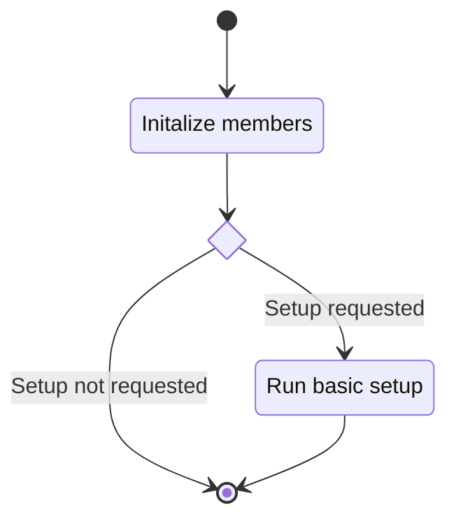
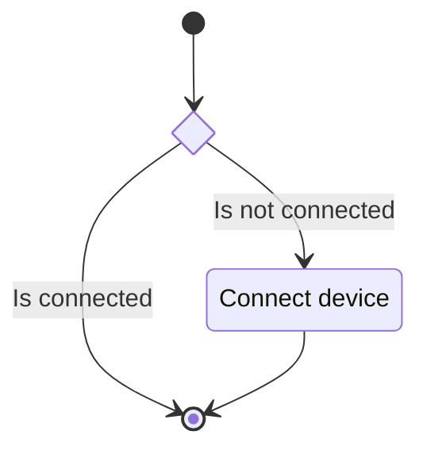

## Description

This unit describes the functionality of the base LED animation serial handling class. The class
maintains a serial connection to a physical device to which it issues commands.

### Members

### Public Interfaces

#### Constructor

The constructor method takes in a collection of data:

- Serial port name: A string representing which serial port to use to connect to the Fastrak.  
- Baudrate: A baudrate to use for the serial connection.
- Serial timeout: How long to wait for the serial connection.
- LED count: Indicates the number of LED to control.  
- Run setup flag: Indicates if the constructor should also set up the Fastrak.

##### State Machine

#### Connect

Attempt to connect the configured serial device.

##### State Machine

## Unit Test Description

No unit tests
