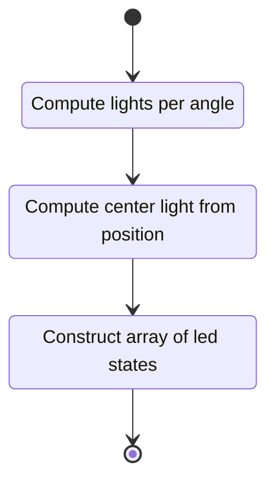

## Description

This unit describes the functionality of the Fastrak Device look position animator. Implements
[unit 00001 base animator](./00001_base_animator.md)

### Members

### Interfaces

#### Compute Data

Computes the data packet to be sent to a Fastrak device. Takes the following as arguments:

- Current Fastrak position
- Look angle to illuminate
- Color data to for the lit NEOPIXEL as one each of
    - Red
    - Green
    - Blue

##### State Machine

## Unit Test Description

No unit tests
